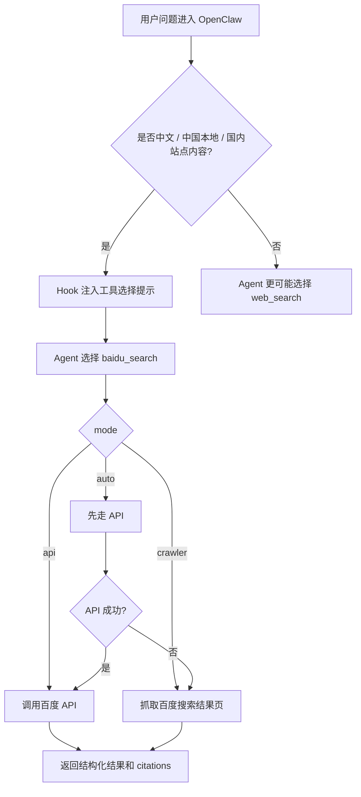
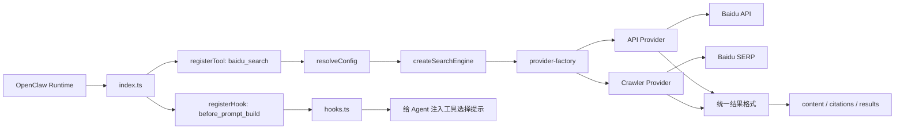

# @z-imagine/openclaw-baidu-search

`@z-imagine/openclaw-baidu-search` 是一个面向 OpenClaw 的原生插件，为 Agent 提供基于百度的中文网页搜索能力。

它不是在重复造一个通用搜索工具，而是在补 OpenClaw 官方 `web_search` 在中国大陆网络环境下的现实短板：可达性、本地化、中文结果质量，以及对中文互联网内容的覆盖。

一句话定位：

- 面向中文、本地、中国相关问题时，给 OpenClaw 一个更可用的搜索入口
- 面向英文、国际、官方文档类问题时，仍然保留 `web_search`

## 为什么需要它

在中国大陆环境里，通用型国际搜索工具通常会遇到几个现实问题：

- 可达性和稳定性不一致，不同网络环境下结果波动很大
- 中文网页覆盖和排序不一定适合本地用户
- 很多国内站点、中文新闻、中文社区内容通过国际搜索引擎并不容易稳定拿到
- 用户明明是在问中文、本地信息或国内语境内容，但 Agent 仍然可能优先走面向国际内容的搜索路径

这个插件的定位不是替换 OpenClaw 的官方 `web_search`，而是给 OpenClaw 增加一条更适合中文互联网和国内网络环境的搜索通道。

## 这个插件给 OpenClaw 暴露了什么

这个项目是一个 OpenClaw `plugin`，不是 `skill`。

它主要向 OpenClaw 暴露两类能力：

- 一个可调用工具：`baidu_search`
- 一个可选 Hook：在 `before_prompt_build` 阶段给 Agent 注入“什么时候该使用 `baidu_search`”的提示

也就是说，它不只是提供底层搜索实现，还会主动帮助 Agent 做工具选择。

## 它适合什么，不适合什么

更适合的场景：

- 用户问题包含中文
- 用户明确提到“百度”或要求搜索国内内容
- 查询目标是中国本地信息、中文新闻、中文社区内容
- OpenClaw 运行在中国大陆网络环境，希望让搜索更稳定一些

不建议把它当成唯一搜索来源的场景：

- 英文技术文档
- 国际新闻和全球资讯
- 明显更适合 Google / Brave / Perplexity 一类国际搜索能力的问题

## 核心能力

- 为 OpenClaw 注册 `baidu_search` 工具
- 支持 `api`、`crawler`、`auto` 三种模式
- 默认返回结构化结果、摘要和引用 URL
- 可在 API 模式失败时自动降级到爬虫模式
- 可通过 Hook 给 Agent 注入工具选择提示
- 发布包只包含运行所需文件，不会把本地 `.env` 一起发布出去

## OpenClaw 里它是怎么工作的

### 1. Tool 暴露

插件注册后，OpenClaw 可以调用：

```text
baidu_search(query, count?)
```

其中：

- `query` 是搜索关键词
- `count` 是返回结果数量，范围 `1-10`

### 2. Hook 引导

如果开启 `hookEnabled`，插件会在构建 prompt 前给系统上下文附加一段指导，让 Agent 更倾向于：

- 中文问题用 `baidu_search`
- 英文或国际问题继续用 `web_search`

### 3. 模式选择

- `api`: 通过百度搜索 API 获取结果，稳定性更高，但需要 API Key
- `crawler`: 直接抓取百度网页结果，不需要 API Key，但更依赖页面结构和网络环境
- `auto`: 优先 API，可配置失败后自动回退到 crawler

## Agent 工作流图

下面这张图描述的是 Agent 在接到用户问题后，什么时候更适合走 `baidu_search`，什么时候继续交给 `web_search`：



这个工作流的重点不是“强制替换所有搜索”，而是让 Agent 在中文语境下更容易走到更合适的搜索路径。

## 插件架构图

下面这张图描述的是插件内部的主要调用链：



架构上它保持了两层隔离：

- OpenClaw 只感知 `tool` 和 `hook`
- API / crawler 的差异被收敛在 search engine 和 provider 层

这样后续如果要扩展新的中文搜索源，改动点会集中在 provider 侧，而不是把 OpenClaw 集成层重新改一遍

## 安装

OpenClaw 安装命令：

```bash
openclaw plugins install @z-imagine/openclaw-baidu-search
```

这个包已经按 OpenClaw 插件格式发布，可以通过包名直接安装，也可以走 ClawHub / npm 的标准插件发布流程。

## 推荐配置

推荐先使用 `auto` 模式：

```json
{
  "plugins": {
    "entries": {
      "baidu-search": {
        "enabled": true,
        "config": {
          "mode": "auto",
          "apiKey": "your-baidu-api-key",
          "fallbackEnabled": true,
          "hookEnabled": true
        }
      }
    }
  }
}
```

这样配置的好处是：

- 有 API Key 时优先走更稳定的 API
- API 不可用时仍然保留 crawler 兜底
- Agent 会更容易在中文场景下自动选对工具

## 配置示例

### API 模式

```json
{
  "plugins": {
    "entries": {
      "baidu-search": {
        "enabled": true,
        "config": {
          "mode": "api",
          "apiKey": "your-baidu-api-key"
        }
      }
    }
  }
}
```

### 爬虫模式

```json
{
  "plugins": {
    "entries": {
      "baidu-search": {
        "enabled": true,
        "config": {
          "mode": "crawler"
        }
      }
    }
  }
}
```

### 自动模式

```json
{
  "plugins": {
    "entries": {
      "baidu-search": {
        "enabled": true,
        "config": {
          "mode": "auto",
          "apiKey": "your-baidu-api-key",
          "fallbackEnabled": true
        }
      }
    }
  }
}
```

## 环境变量

也可以通过环境变量配置：

```bash
export BAIDU_SEARCH_MODE="auto"
export BAIDU_API_KEY="your-api-key"
```

`.env` 更适合本地调试，不建议把真实密钥提交进仓库。

## 配置项说明

| 配置项 | 类型 | 默认值 | 说明 |
|--------|------|--------|------|
| `mode` | string | `"auto"` | 搜索模式：`api` / `crawler` / `auto` |
| `apiKey` | string | - | 百度 API Key（API 模式需要） |
| `timeout` | number | `30` | 请求超时时间，单位秒 |
| `retryCount` | number | `3` | 失败重试次数 |
| `fallbackEnabled` | boolean | `true` | 是否允许模式降级 |
| `hookEnabled` | boolean | `true` | 是否向 Agent 注入工具选择提示 |

### crawler 配置

| 配置项 | 类型 | 默认值 | 说明 |
|--------|------|--------|------|
| `userAgent` | string | Chrome UA | 自定义 User-Agent |
| `minInterval` | number | `1000` | 最小请求间隔（毫秒） |
| `resolveRedirects` | boolean | `false` | 是否解析跳转 URL |
| `proxyUrl` | string | - | 代理服务器 URL |

## 模式对比

| 维度 | API 模式 | Crawler 模式 |
|------|----------|--------------|
| 稳定性 | 高 | 中 |
| 配置成本 | 需要 API Key | 无 |
| 国内可用性 | 好 | 好 |
| 响应速度 | 通常更快 | 通常略慢 |
| 维护成本 | 低 | 较高 |

## 使用效果示例

典型预期行为：

```text
用户: 帮我搜索一下 OpenClaw 是什么
Agent: 调用 baidu_search

用户: 查一下北京今天的天气
Agent: 调用 baidu_search

用户: Search for OpenClaw plugin SDK docs
Agent: 更可能调用 web_search
```

## 获取百度 API 凭证

1. 访问 [百度智能云控制台](https://console.bce.baidu.com/)
2. 创建应用或开通对应搜索能力
3. 获取 API Key
4. 配置到 OpenClaw

## 发布与打包

项目里已经提供了常用脚本：

```bash
# 推送子项目到独立 GitHub 仓库
pnpm run publish:github

# npm 发布
pnpm run publish:npm

# 生成 ClawHub / 安装分发包
pnpm run pack:clawhub

# 通过 ClawHub CLI 发布插件
pnpm run publish:clawhub

# 一次串行执行 GitHub -> npm -> ClawHub
pnpm run release:all
```

发布包默认只包含运行所需文件：

- `dist/*`
- `openclaw.plugin.json`
- `package.json`
- `README.md`

不会包含：

- `.env`
- `node_modules`
- 本地测试文件
- 生成的 `.tgz`

## 开发

```bash
pnpm install
pnpm run build
pnpm run test
pnpm run typecheck
pnpm run dev
```

## 本地测试

详细测试说明见 [TESTING.md](./TESTING.md)。

快速测试：

```bash
# 构建
pnpm run build

# 运行独立测试
npx tsx test-standalone.ts
```

## 项目结构

```text
@z-imagine/openclaw-baidu-search/
├── index.ts
├── openclaw.plugin.json
├── src/
│   ├── config.ts
│   ├── error-handler.ts
│   ├── hooks.ts
│   ├── provider-factory.ts
│   ├── search-engine.ts
│   ├── types.ts
│   └── providers/
└── scripts/
```

## License

MIT
